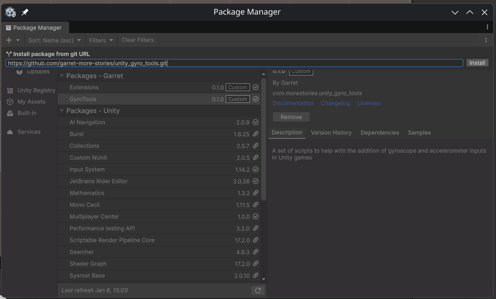
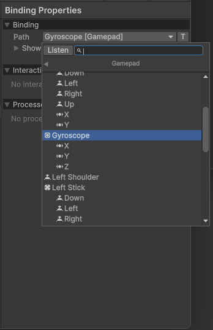

# Unity Gyro Tools (Alpha)
A work in progress unity package that aims to make the implementation of gyroscopic and accelerometer controls be as seamless as possible with the [Unity Input System](https://github.com/Unity-Technologies/InputSystem). Utilizes [SDL3](https://github.com/libsdl-org/SDL) to read IMU's from compatible controllers.

## How to Use
1. Install package through Unity Package Manager

Add the package with the git url:
> https://github.com/garret-more-stories/unity_gyro_tools.git

2. Assign IMU binding to input action

Look for the either the "Gyroscope" and "Accelerometer" controls in Gamepad derived layouts and assign it to your preferred action.
> Note: IMU controls must be used with Input Actions that are expecting a Vector 3 control

3. Connect controller with SDL3 compatible gyro

You should now be able to read the IMU from the Input Action you assigned the binding to.

## Minimum version
THe package has been tested to work on versions of Unity starting from 2022.3.37f1. In theory, earlier Unity versions should work but this still has not been tested.

## Acknowledgements
It goes without saying that utilizing the gyroscope like this wouldn't have been possible without the fine work from the [SDL3](https://github.com/libsdl-org/SDL) developers. All this package does is use their tools to inject the IMU input into Unity.
